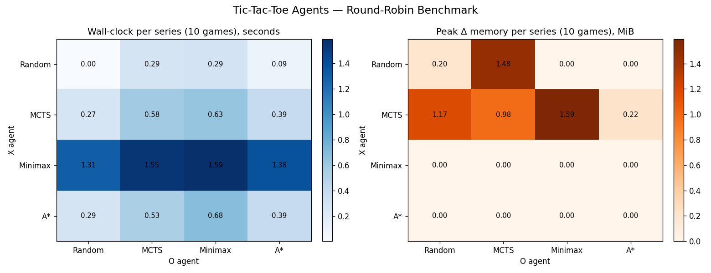

# Tic-Tac-Toe Experiment

Part of my university study, I came up with this experiment to test my recent research on the Minimax Alpha-Beta pruning algorithm and Monte Carlo Tree Search (MCTS). This experiment is inspired by [Google DeepMind's AlphaGo in 2015](https://www.youtube.com/watch?v=WXuK6gekU1Y).

A great repo for those who want to learn about foundamental AI algorithms in games. Feel free to make pull requests if you have any suggestions or improvements.

## Experiment Introduction

1. Human vs. Minimax Alpha-Beta Pruning
2. Human vs. Monte Carlo Tree Search (MCTS)
3. Minimax Alpha-Beta Pruning vs. Monte Carlo Tree Search (MCTS)

## Limitations

This experiment does not include neural networks or deep learning techniques, as it focuses on traditional game tree search algorithms. Well, I might still put it in my future research plan.

## Benchmarks

A round-robin between every agent (10 games per ordered pair, X vs O) was run with [`benchmarks/run_benchmark.py`](benchmarks/run_benchmark.py), which uses [`memory_profiler`](https://pypi.org/project/memory-profiler/) to sample peak resident memory and `time.perf_counter` for wall-clock cost. Raw output is in [`benchmarks/results.json`](benchmarks/results.json).

Reproduce with:

```bash
pip install memory_profiler matplotlib
python -m benchmarks.run_benchmark
```

### Win matrix (X-agent rows, O-agent columns, 10 games each)

| X \ O       | Random        | MCTS          | Minimax       | A*            |
|-------------|---------------|---------------|---------------|---------------|
| **Random**  | X 10 / D 0 / O 0 | X 0 / D 10 / O 0 | X 0 / D 0 / O 10 | X 0 / D 0 / O 10 |
| **MCTS**    | X 10 / D 0 / O 0 | X 0 / D 10 / O 0 | X 0 / D 10 / O 0 | X 0 / D 10 / O 0 |
| **Minimax** | X 10 / D 0 / O 0 | X 0 / D 10 / O 0 | X 0 / D 10 / O 0 | X 10 / D 0 / O 0 |
| **A***      | X 10 / D 0 / O 0 | X 0 / D 0 / O 10 | X 0 / D 10 / O 0 | X 10 / D 0 / O 0 |

### Time and memory



Per-series totals (10 games):

| Pairing (X vs O)    | Time (s) | Δ Peak Mem (MiB) |
|---------------------|---------:|-----------------:|
| Random  vs Random   |     0.00 |             0.19 |
| Random  vs MCTS     |     0.28 |             1.76 |
| Random  vs Minimax  |     0.31 |             0.00 |
| Random  vs A*       |     0.09 |             0.00 |
| MCTS    vs Random   |     0.27 |             1.22 |
| MCTS    vs MCTS     |     0.65 |             1.15 |
| MCTS    vs Minimax  |     0.66 |             1.55 |
| MCTS    vs A*       |     0.42 |             0.13 |
| Minimax vs Random   |     1.38 |             0.00 |
| Minimax vs MCTS     |     1.64 |             0.06 |
| Minimax vs Minimax  |     1.68 |             0.00 |
| Minimax vs A*       |     1.46 |             0.00 |
| A*      vs Random   |     0.31 |             0.00 |
| A*      vs MCTS     |     0.56 |             0.01 |
| A*      vs Minimax  |     0.56 |             0.00 |
| A*      vs A*       |     0.41 |             0.00 |

### Observations

* **Tic-tac-toe is solved**, so every "strong vs strong" pairing draws — that's why the MCTS / Minimax / A\* diagonal of the win matrix is all zeros except for the known A\*-greedy-model exploits.
* **Memory is dominated by MCTS** (~1–2 MiB per series): each turn it allocates a fresh search tree, while Minimax and A\* run in essentially constant space (the `+0.00 MiB` rows mean the delta was below the sampler's resolution).
* **Time is dominated by Minimax** (~1.5 s per series): with no transposition table it visits ~5,478 distinct positions per move from the empty board. MCTS at 400 iterations and A\* with its heuristic both finish in well under half that.
* **Minimax beats A\*** because A\*'s greedy opponent model is weaker than true minimax — exactly the gap that motivates DeepMind-style hybrids that combine search (MCTS) with learned value/policy networks.
* **A\* vs A\*** is deterministic (same seed, same heuristic) so the first-mover (X) always wins — neither side defends correctly against itself, illustrating why best-first heuristic search alone isn't sufficient for adversarial games.


## License

This project is licensed under the MIT License - see the [LICENSE](LICENSE) file for details.

## Author
- [Chrisio Gwaan](https://github.com/ChrisioGwaan)
